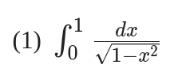
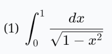

# Markdown-it plugin of KaTeX

This package is some improvement for the original `Markdown-it-katex` package at `https://www.npmjs.com/package/markdown-it-katex`

Improvements are:
- Added types for the function, it is originally typescripted now.
- Made it possible to typeset "display style" math "inline".

# Installation

This is a plugin for [Markdown-it](https://www.npmjs.com/package/markdown-it), so please install Markdown-it as a prerequisite.


```shell
npm install -S markdown-it @littlefattie/markdown-it-katex
```

# Usage

```typescript
import MarkdownIt from "markdown-it";
import MkdKatex, { PluginOptions } from "@littlefattie/markdown-it-katex";

const mkd = MarkdownIt();
mkd.use(MkdKatex, {
  output: "html",
  showInlineWithDisplayStyle: true,
  errorColor: "#cc0000",
  throwOnError: false,
} as PluginOptions);

mkd.render('$\\int_0^1\\dfrac{dx}{\\sqrt{1-x^2}}$')

```
To display the math correctly, you also need to include `KaTeX` css file in your Markdown page, i.e.:

```html
<link rel="stylesheet" href="https://cdn.jsdelivr.net/npm/katex@0.15.1/dist/katex.min.css" integrity="sha384-R4558gYOUz8mP9YWpZJjofhk+zx0AS11p36HnD2ZKj/6JR5z27gSSULCNHIRReVs" crossorigin="anonymous">
```
# Some other notes

This package is almost one-to-one copy of the package of [markdown-it-katex](https://www.npmjs.com/package/markdown-it-katex) by Waylon Flinn. I add some type annotations for the function, to easily integrate into projects using typescript. And I add one extra option for the input, to make it possible that "display style math" could be shown "inline". I implement this by picking only the "math typeset" part, and abandon outermost block tag.

it is something like:

```html
Original    --> <span class="katex-display"><span class="katex">...The math typeset...</span></span>
Picked part -->                             <span class="katex">...The math typeset...</span>
```

And the requirement of showing display style math inline comes from the fact that when presenting some complex math inline, it would be very small if we show it with inline style.
Here is some comparasion:

Inline math with inline style:


Inline math with display style:


# Links

The original `Markdown-it-katex` package: [https://www.npmjs.com/package/markdown-it-katex](https://www.npmjs.com/package/markdown-it-katex)
